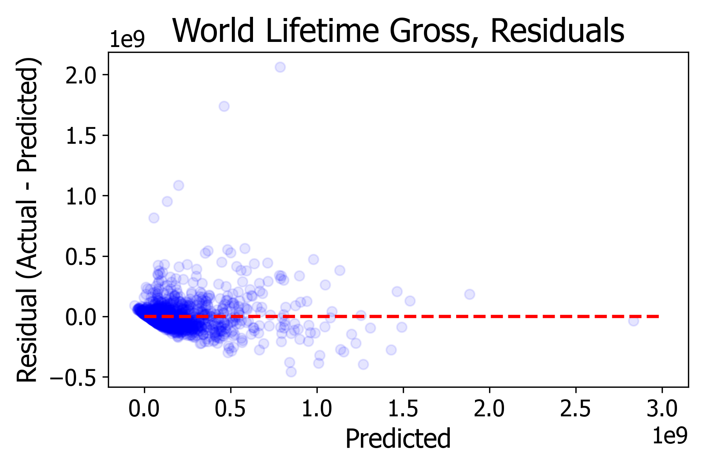
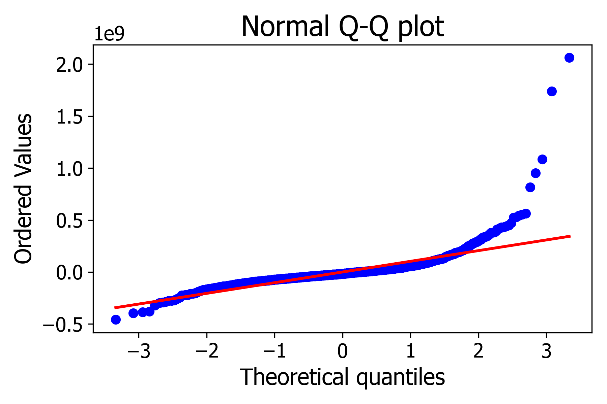

# Minimum Viable Product
## Interpreting the impact of lead-actor demographics on film revenue

The goal of this project is to determine the impact of lead-actor demographics (primarily, gender and age) on worldwide, lifetime movie gross of some of the most successful movies of all time.

To do this, I have scraped the following data for 6000 of the highest grossing movies of all time: title, worldwide lifetime movie gross (target), studio, domestic opening weekend gross, budget, MPAA rating, runtime, genre, lead actor name, height, gender, and age at the time of the movie opening, and the Rotten Tomatoes audience and Tomatometer scores. After removing movies for which sufficient information is not available (i.e., if any of the opening weekend gross, budget, Rotten Tomatoes scores, or lead actor age is not known), we are left with a sample of >2000 movies.

To begin building a regression model, I carry out a k-fold cross-validation (k=5) with linear regression, where the target is the  worldwide lifetime movie gross, and the included features are: domestic opening weekend gross (and its square), budget, the Rotten Tomatoes audience and Tomatometer scores, and the lead actor gender (as a dummy variable) and age. The figure below (left) shows the lifetime movie grosses predicted for the training data (which contains 80% of the dataset) versus the actual values observed. For an R2 = 1.0, the predictions should be exactly equal to the observed values, such that the blue data points all lie along the red, dashed line. For the model depicted here, the cross-validated R2 = 0.732694.

The next figure (center) shows the residuals, and the last figure (right) shows the q-q plot. The q-q plot indicates that the predicted values are heavy-tailed, meaning that, in it's current form, the model does not correctly summarize the underlying relationship between the selected features and the target. To improve the model, I plan to transform the monetary target and features (i.e., domestic opening weekend gross, budget) to log scale.

  
  
  

These results show that a significant proportion of the variance is explained by the current model, however, I hope to improve the R2 by (1) log-scaling some of the features, (2) incorporating the studio and movie genres as dummy variables, and (3) testing LASSO and Ridge regression models to find the .
